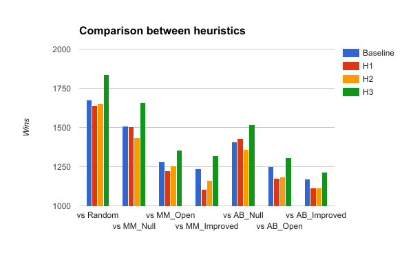

## Heuristic Analysis

### Evaluation Heuristics

- H1: Minimize opponent open moves
- H2: Average future moves
- H3: Active player open moves

To win an isolation game, a player have to make the opponent have no move to play.
The player also need to play as many consecutive plays as possible.
So I implemented H1, to see if the number of opponent open moves is a good heuristic.

H2 simulate every possible moves of current game state,
and get the number of possible moves of the simulated moves, then take the average.
I think it may be a better heuristic because it forecast a further step.

I also wonder if turns (which player is active) can help me evaluation game state.
In H3, I use the number of possible moves of active player.
If the player is active, use the number of moves as score.
If the opponent is active, then subtract the number of moves from the maximum possible moves.
So when player is active, it give higher score if player has more open moves.
When the opponent is active, the more moves opponent has, the lower score is returned.
This heuristic is also good for minimum calculation.
It is O(n) bounded, where n is the maximum number of possible moves.
Compare to O(4n) for improved score(worst-case), O(3n) for H1, and O(n2) for H2,
this evaluation is very efficient.

### Performance

|Heuristic|Result|Opponent|
|:-:|---|:-:|
|H1|65.68%|68.01%|
|H2|65.45%|68.33%|
|H3|72.95%|67.81%|

I ran 500 matches against each agent, 2000 games each round in total.
The result of a single game affect the win rate by a very small amount(only 0.05% in a round).

Suprisingly, only the most efficient heuristic outperformed the baseline opponent.
The head-to-head comparison between different agents showed that H3 has highest win rate versus each test agent.

H3 dominated the random agent with over 90% win rate,
while other heuristics also have at least 80% win rate.
The win rate lowered against minimax and alpha-beta agents.
As expected, the alpha-beta agents is a tougher opponent than the minimax agents.
For both algorithm, improved score is the best heuristic, and the null score is the worst heuristic.
H1 only beat H2 when facing null score, but the average win rates are about the same.

### Recommendation

I recommend the evaluation funciton H3 because it is best among three heuristics.

The three heuristics has different characteristics.
H1 is intuitive.
H2 stand for deep forecast and has massive computation.
H3 combine multiple features while be efficient.

I think H3 win because:

- Efficient: minimum calculation leads to higher chance to iterate deeper
  In comparison, H2 use massive calculation but it still can't beat the improved score.
- Useful information: Each feature used by H3 (active player, open moves, opponent moves) represented different simple, useful information
- Mix factors well

To come up with a good idea for heuristic is not easy, but I think what mentioned above are good principles for create a excellent one.
